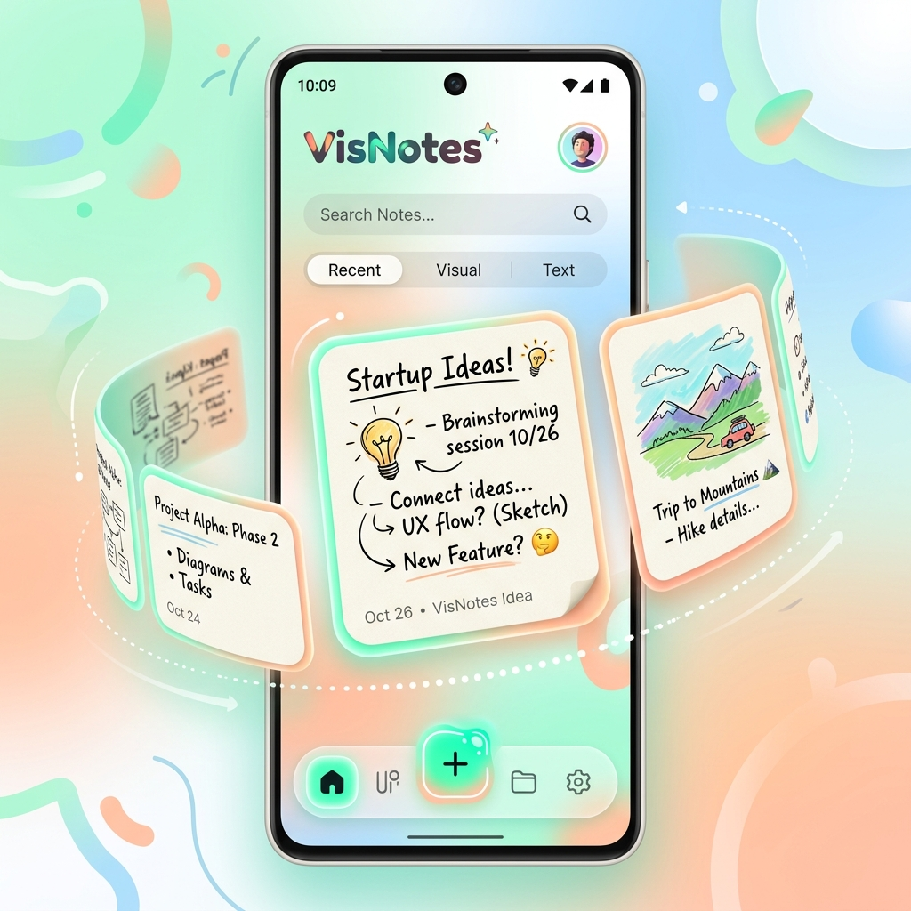
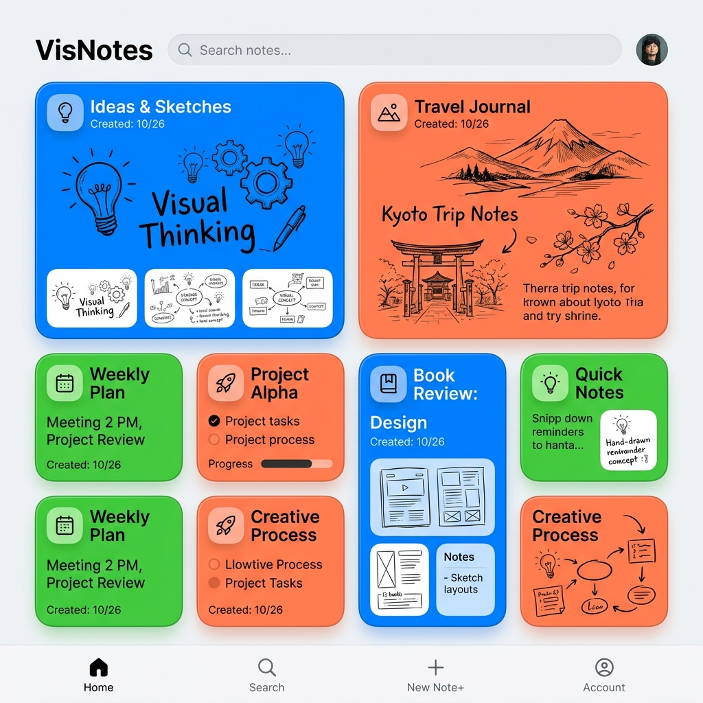
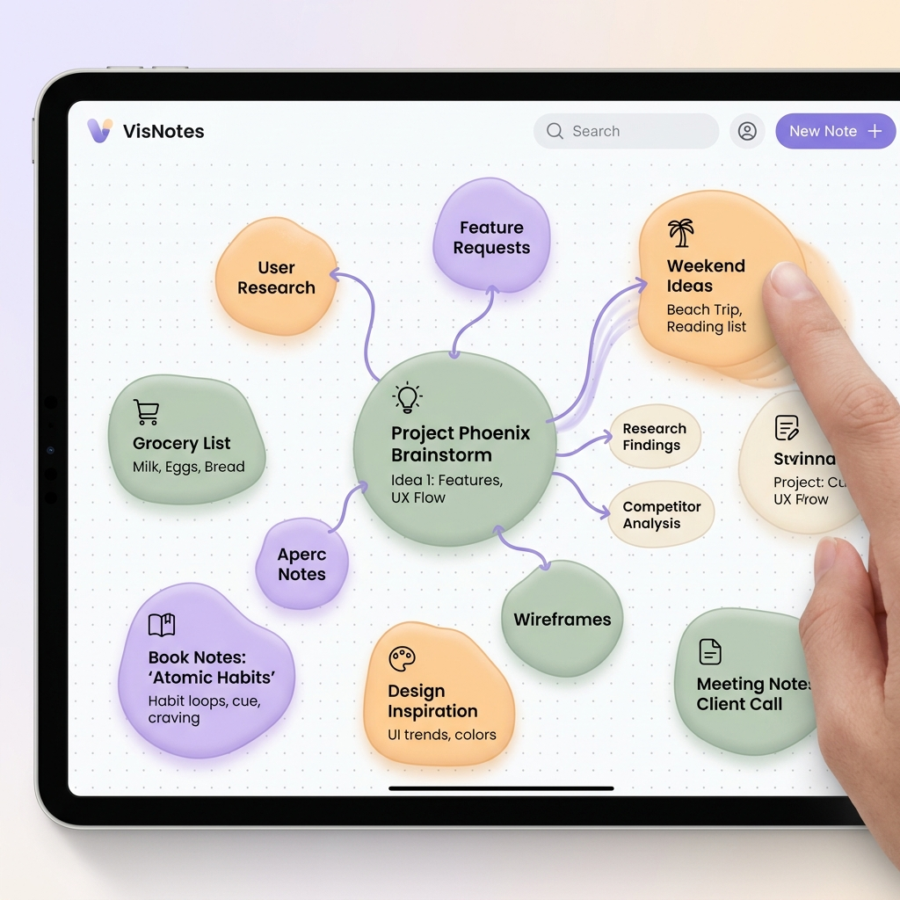
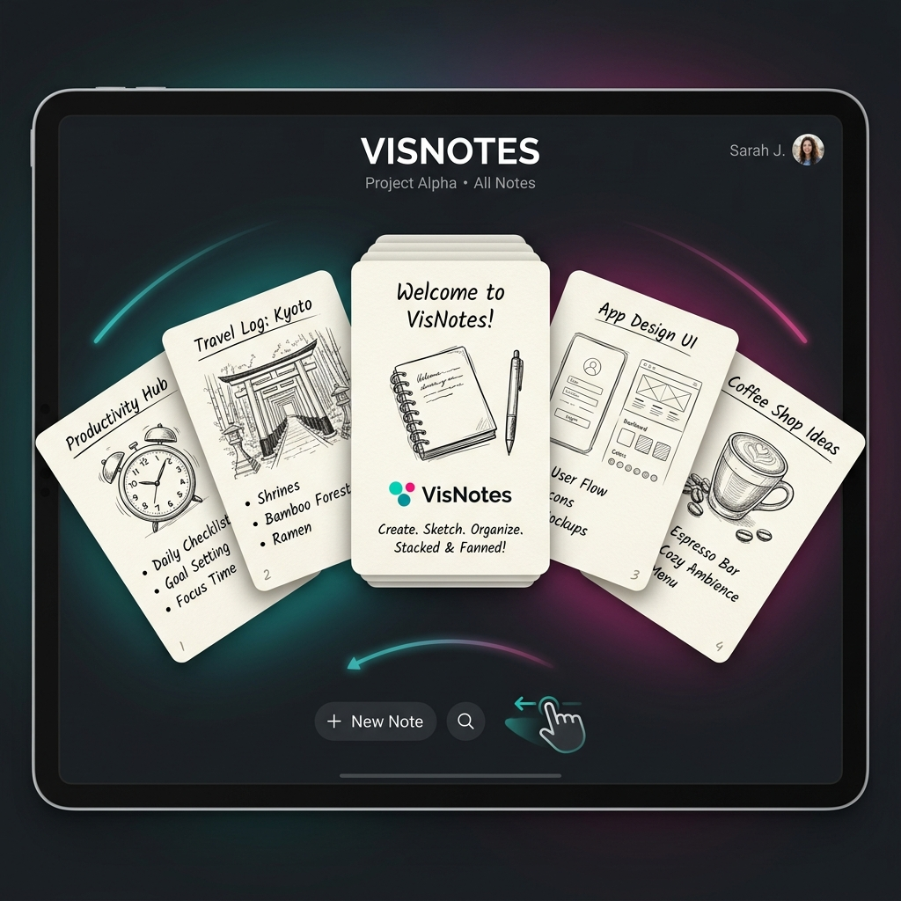
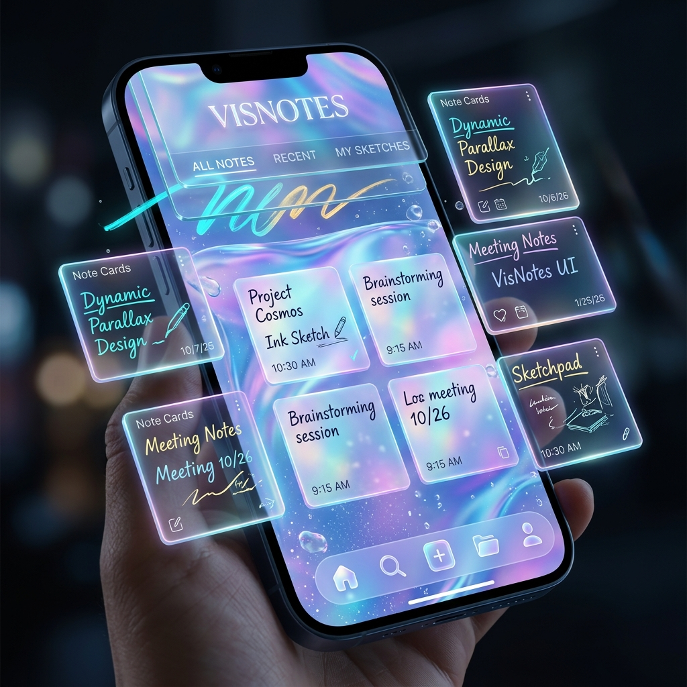
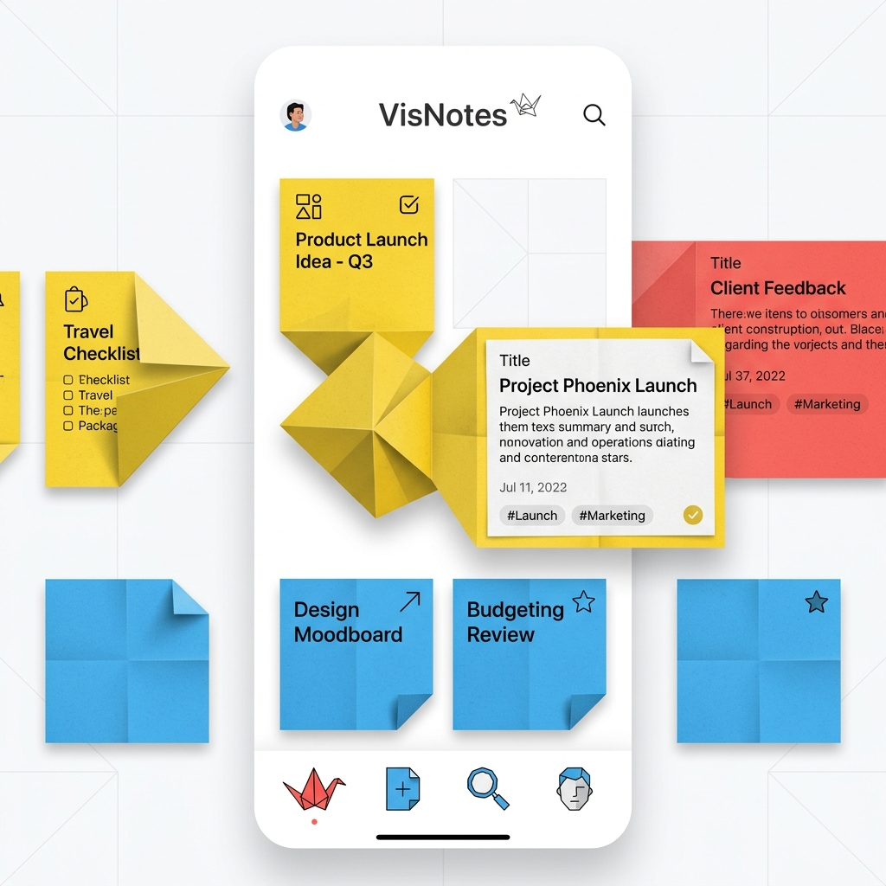

# 🎨 VisNotes: Home Screen Design Explorations

This document presents 6 unique, playful, and high-fidelity design concepts for the VisNotes Home Screen. Each design focuses on **rich animation**, **unique interactivity**, and a **premium feel**.

---

## 1. The "Fluid Spline" Carousel
**Vibe:** Organic, 3D, Playful
- **Concept:** Large, rounded note cards float along a curved 3D path (the spline).
- **Animation:** Scrolling feels like a rubber band; cards rotate and scale as they move into the foreground.
- **Why it's unique:** It breaks the traditional "flat grid" and makes browsing your notes feel like an interactive journey.

---

## 2. The "Bento Box" Interactive Grid
**Vibe:** Tactile, Organized, Vibrant
- **Concept:** Multi-sized tiles with extremely soft corners, inspired by modern gadget interfaces.
- **Animation:** Tiles expand or "squish" when tapped. Each tile has its own vibrant color and depth.
- **Why it's unique:** It’s highly information-dense but feels like a toy box. You want to touch every button.

---

## 3. The "Ink Nodes" Spatial Map
**Vibe:** Artistic, Fluid, Minimalist
- **Concept:** Notes appear as organic "blobs" or bubbles connected by playful ink strings.
- **Animation:** You can drag bubbles around; they have rubbery physics and bounce off each other.
- **Why it's unique:** It visualizes your notes as a living "mind map" rather than a file system.

---

## 4. The "Card Fan" Stack
**Vibe:** Sleek, Premium, Physical
- **Concept:** Your notes are stacked in a central "deck". 
- **Animation:** Swiping "fans" the cards out in a semi-circle, allowing you to flick through them like a deck of cards.
- **Why it's unique:** It brings the satisfying physical feeling of paper cards to the digital screen.

---

## 5. The "Holographic Parallax"
**Vibe:** Deep, Futuristic, Shimmering
- **Concept:** Multiple glass layers with iridescent, pearlescent materials.
- **Animation:** Moving the device (or mouse) reveals deep parallax shifts between ink strokes, text, and shadows.
- **Why it's unique:** It feels like a holographic projection floating in a crystal-clear liquid.

---

## 6. The "Origami Fold"
**Vibe:** Geometric, Poppy, Sharp
- **Concept:** Notes fold and unfold like paper art when selected.
- **Animation:** 3D paper-folding transitions with satisfying "snap" sounds. Uses bright, primary colors.
- **Why it's unique:** It turns every note-opening action into a piece of digital origami.

